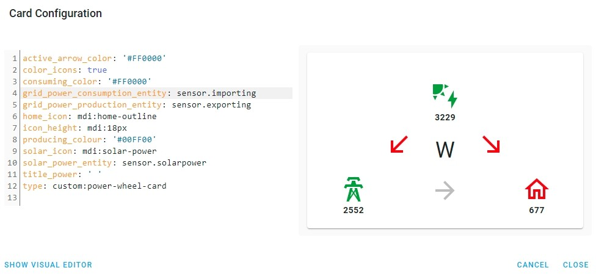

# Python script: `Enphase Envoy mqtt json for Home Assistant`

A Python script that takes a real time stream from Enphase Envoy and publishes to a mqtt broker. This can then be used within Home Assistant or for other applications. The data updates at least once per second with negligible load on the Envoy.

## Requirements

- An Enphase Envoy. Note - Tested with Envoy-S-Metered-EU
- A system running python3 with the `paho.mqtt` python library
- The normal way to install `paho.mqtt` is 
```
    pip install paho-mqtt
```
- If that doesn't work, try
```
git clone https://github.com/eclipse/paho.mqtt.python
cd paho.mqtt.python
python setup.py install
```
- The serial number of your Envoy. Can be obtained by browsing to "http://envoy.local"
- The installer password for your envoy. To obtain, run the `passwordCalc.py` script using the Envoys serial number after first editing the file and inserting your serial number. Don't change the `userName` - it must be installer
    - This program courtesy of "https://github.com/sarnau/EnphaseEnergy"
- A mqtt broker - this can be external or use the `Mosquitto broker` from the Home Assistant Add-on store
    - If you use the add-on, create a Home Assistant user/password for mqtt as described in the `Mosquitto broker` installation instructions
## Install

- Copy to host
- Configure settings in `envoy_to_mqtt_json.py`

## Run Script
```
/path/to/python3 /path/to/envoy_to_mqtt_json.py
```
Run it as a daemon - an example for `macOs` is to create a `~/Library/LaunchAgents/envoy.plist`

```
<?xml version="1.0" encoding="UTF-8"?>
<!DOCTYPE plist PUBLIC "-//Apple//DTD PLIST 1.0//EN" "http://www.apple.com/DTDs/PropertyList-1.0.dtd">
<plist version="1.0">
<dict>
	<key>Disabled</key>
	<false/>
	<key>EnvironmentVariables</key>
	<dict>
		<key>PATH</key>
		<string>/usr/local/bin:/usr/bin:/bin:/usr/sbin:/sbin:/Library/Apple/usr/bin:/usr/local/sbin</string>
	</dict>
	<key>KeepAlive</key>
	<true/>
	<key>Label</key>
	<string>envoy</string>
	<key>ProgramArguments</key>
	<array>
		<string>/path/to/python3</string>
		<string>/path/to/envoy_to_mqtt_json.py</string>
	</array>
	<key>RunAtLoad</key>
	<true/>
</dict>
</plist>
```
Then use `launchctl` to load the plist from a terminal:
```
launchctl load ~/Library/LaunchAgents/envoy.plist
```

To stop it running use

```
launchctl unload ~/Library/LaunchAgents/envoy.plist
```

## Run as systemd service on Ubuntu 

Take note of where your python file has been saved as you need to point to it in the service file

```
/path/to/envoy_to_mqtt_json.py
```

Using a bash terminal

```
cd /etc/systemd/system
```

Create a file with your favourite file editor called envoy.service and add the following

```
[Unit]
Description=Envoy stream to MQTT

[Service]
Type=simple
ExecStart=/path/to/envoy_to_mqtt_json.py
Restart=on-failure

[Install]
WantedBy=multi-user.target
```

Save and close the file then run the following commands

```
sudo systemctl daemon-reload
```
```
sudo systemctl enable envoy.service
```
```
sudo systemctl start envoy.service
```
You can check the status of the service at any time by the command
```
systemctl status envoy
```

Note: this should work for any linux distribution that uses systemd services, but the instructions and locations may vary slightly.

## Example output
The resulting mqtt topic should look like this example:
```
{
    "production": {
        "ph-a": {
            "p": 351.13,
            "q": 317.292,
            "s": 487.004,
            "v": 244.566,
            "i": 1.989,
            "pf": 0.72,
            "f": 50.0
        },
        "ph-b": {
            "p": 0.0,
            "q": 0.0,
            "s": 0.0,
            "v": 0.0,
            "i": 0.0,
            "pf": 0.0,
            "f": 0.0
        },
        "ph-c": {
            "p": 0.0,
            "q": 0.0,
            "s": 0.0,
            "v": 0.0,
            "i": 0.0,
            "pf": 0.0,
            "f": 0.0
        }
    },
    "net-consumption": {
        "ph-a": {
            "p": 21.397,
            "q": -778.835,
            "s": 865.208,
            "v": 244.652,
            "i": 3.539,
            "pf": 0.03,
            "f": 50.0
        },
        "ph-b": {
            "p": 0.0,
            "q": 0.0,
            "s": 0.0,
            "v": 0.0,
            "i": 0.0,
            "pf": 0.0,
            "f": 0.0
        },
        "ph-c": {
            "p": 0.0,
            "q": 0.0,
            "s": 0.0,
            "v": 0.0,
            "i": 0.0,
            "pf": 0.0,
            "f": 0.0
        }
    },
    "total-consumption": {
        "ph-a": {
            "p": 372.528,
            "q": -1096.126,
            "s": 1352.165,
            "v": 244.609,
            "i": 5.528,
            "pf": 0.28,
            "f": 50.0
        },
        "ph-b": {
            "p": 0.0,
            "q": 0.0,
            "s": 0.0,
            "v": 0.0,
            "i": 0.0,
            "pf": 0.0,
            "f": 0.0
        },
        "ph-c": {
            "p": 0.0,
            "q": 0.0,
            "s": 0.0,
            "v": 0.0,
            "i": 0.0,
            "pf": 0.0,
            "f": 0.0
        }
    }
}
```
```
__Note__: Data is provided for three phases - unused phases have values of `0.0`
```
## Description of labels 
- more info here "https://www.greenwoodsolutions.com.au/news-posts/real-apparent-reactive-power"

```
"production": = Solar panel production - always positive value
"total-consumption": = Total Power consumed - always positive value
"net-consumption": = Total power Consumed minus Solar panel production. Will be positive when importing and negative when exporting
    
    "ph-a" = Phase A    
    "ph-b" = Phase B
    "ph-c" = Phase C

        "p": =  Real Power ** This is the one to use
        "q": =  Reactive Power
        "s": =  Apparent Power
        "v": =  Voltage
        "i": =  Current
        "pf": = Power Factor
        "f": =  Frequency
```          
## `value_template` configuration examples
```yaml
value_template: '{{ value_json["total-consumption"]["ph-a"]["p"] }}' # Phase A Total power consumed by house
value_template: '{{ value_json["net-consumption"]["ph-c"]["p"] }}'   # Phase C - Total Power imported or exported
value_template: '{{ value_json["production"]["ph-b"]["v"] }}'   # Phase B - Voltage produced by panels
value_template: '{{ value_json["production"]["ph-a"]["p"] | int + value_json["production"]["ph-b"]["p"] | int + value_json["production"]["ph-c"]["p"] | int }}'  # Adding all three Production phases

```

## `configuration.yaml` configuration examples
```yaml
# Example configuration.yaml entry
#
# Creates sensors with names such as sensor.mqtt_production
#
sensor:
  - platform: mqtt
    state_topic: "/envoy/json"
    name: "mqtt_production"
    qos: 0
    unit_of_measurement: "W"
    value_template: '0{{ value_json["production"]["ph-a"]["p"]  | int }}'
    state_class: measurement
    device_class: power

  - platform: mqtt
    state_topic: "/envoy/json"
    value_template: '{{ value_json["total-consumption"]["ph-a"]["p"] }}'
    name: "mqtt_consumption"
    qos: 0
    unit_of_measurement: "W"
    state_class: measurement
    device_class: power

  - platform: mqtt
    state_topic: "/envoy/json"
    name: "mqtt_power_factor"
    qos: 0
    unit_of_measurement: "%"
    value_template: '{{ value_json["total-consumption"]["ph-a"]["pf"] }}'
    state_class: measurement
    device_class: power_factor

  - platform: mqtt
    state_topic: "/envoy/json"
    name: "mqtt_voltage"
    qos: 0
    unit_of_measurement: "V"
    value_template: '{{ value_json["total-consumption"]["ph-a"]["v"] }}'
    state_class: measurement
    device_class: voltage
#
```
## Real time power display using Power Wheel Card

Here's the code if you'd like real-time visualisations of your power usage like this:



Power Wheel card:

```yaml
active_arrow_color: '#FF0000'
color_icons: true
consuming_color: '#FF0000'
grid_power_consumption_entity: sensor.importing
grid_power_production_entity: sensor.exporting
home_icon: mdi:home-outline
icon_height: mdi:18px
producing_colour: '#00FF00'
solar_icon: mdi:solar-power
solar_power_entity: sensor.solarpower
title_power: ' '
type: custom:power-wheel-card
```
configuration.yaml:

```yaml
sensor:
  
  #
  # These ones are for Envoy via mqtt
  #
  - platform: mqtt
    state_topic: "/envoy/json"
    name: "mqtt_production"
    qos: 0
    unit_of_measurement: "W"
    value_template: '0{{ value_json["production"]["ph-a"]["p"]  | int }}'
    state_class: measurement
    device_class: power

  - platform: mqtt
    state_topic: "/envoy/json"
    value_template: '{{ value_json["total-consumption"]["ph-a"]["p"] }}'
    name: "mqtt_consumption"
    qos: 0
    unit_of_measurement: "W"
    state_class: measurement
    device_class: power

  - platform: template
    sensors:
      exporting:
        friendly_name: "Current MQTT Energy Exporting"
        value_template: "{{ [0, (states('sensor.mqtt_production') | int - states('sensor.mqtt_consumption') | int)] | max }}"
        unit_of_measurement: "W"
        icon_template: mdi:flash
      importing:
        friendly_name: "Current MQTT Energy Importing"
        value_template: "{{ [0, (states('sensor.mqtt_consumption') | int - states('sensor.mqtt_production') | int)] | max }}"
        unit_of_measurement: "W"
        icon_template: mdi:flash
      solarpower:
        friendly_name: "Solar MQTT Power"
        value_template: "{{ states('sensor.mqtt_production')}}"
        unit_of_measurement: "W"
        icon_template: mdi:flash
```
## Donation
If this project helps you, you can give me a cup of coffee<br/>
[](https://paypal.me/vk2him)
<br/><br/>
